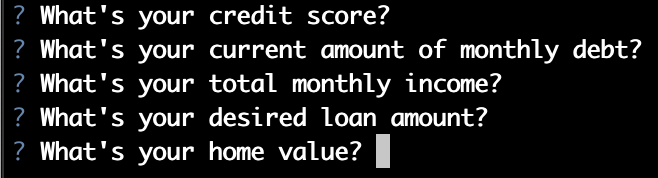
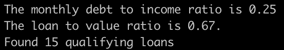
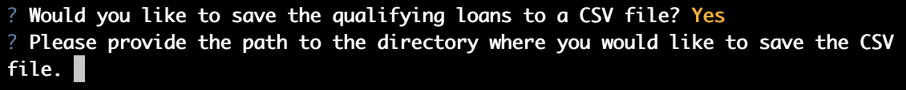
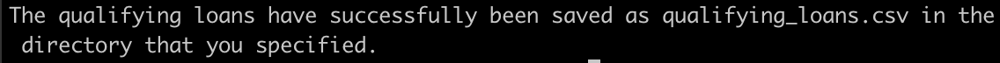

# Automated Loan Qualifier

This project is a prototype of an automated loan qualifer that allows nontechnical users to interact with the program through a command-line interface. The user can choose to save the results to a CSV file for easy sharing.

## Technologies

This project leverages python 3.7 with the following packages:

* [fire](https://github.com/google/python-fire) - For the command line interface, help page, and entry-point.

* [questionary](https://github.com/tmbo/questionary) - For interactive user prompts and dialogs

## Installation Guide

Before running the application first install the following dependencies.

```python
  pip install fire
  pip install questionary
```

## Usage

To use the automated loan qualifier application clone the repository and run the following command in the directory where **app.py** is located:

```python
  python app.py
```  

The following prompt will appear:

  

The daily rate sheet is located in the data folder. The following response will direct the program to the accompanying rate sheet. 

```python
  data/daily_rate_sheet.csv
```

**Important:** Do not include quotations around any of the responses. Also, when responding to questions asking about dollar values do not include dollar signs or commas. A proper response would be in the following form: `4250.50`

The following prompts will be generated sequentially.  



Here is an example result:



Next, the app will ask you if you'd like to save the qualifying loans to a CSV file. If you enter `Y` you will be asked where you'd like to save the file.



To save the files to the data directory enter:

```python
  ./data/
```

If you hit enter without providing a directory the results will saved in the same directory where the app in running. The following response will be generated, then the application will close.



## Contributors

Josh Mischung: [josh@knoasis.io](josh@knoasis.io), [LinkedIn](https://www.linkedin.com/in/joshmischung/)

## License

MIT License

Copyright (c) [2021] [Joshua Mischung]

Permission is hereby granted, free of charge, to any person obtaining a copy
of this software and associated documentation files (the "Software"), to deal
in the Software without restriction, including without limitation the rights
to use, copy, modify, merge, publish, distribute, sublicense, and/or sell
copies of the Software, and to permit persons to whom the Software is
furnished to do so, subject to the following conditions:

The above copyright notice and this permission notice shall be included in all
copies or substantial portions of the Software.

THE SOFTWARE IS PROVIDED "AS IS", WITHOUT WARRANTY OF ANY KIND, EXPRESS OR
IMPLIED, INCLUDING BUT NOT LIMITED TO THE WARRANTIES OF MERCHANTABILITY,
FITNESS FOR A PARTICULAR PURPOSE AND NONINFRINGEMENT. IN NO EVENT SHALL THE
AUTHORS OR COPYRIGHT HOLDERS BE LIABLE FOR ANY CLAIM, DAMAGES OR OTHER
LIABILITY, WHETHER IN AN ACTION OF CONTRACT, TORT OR OTHERWISE, ARISING FROM,
OUT OF OR IN CONNECTION WITH THE SOFTWARE OR THE USE OR OTHER DEALINGS IN THE
SOFTWARE.
